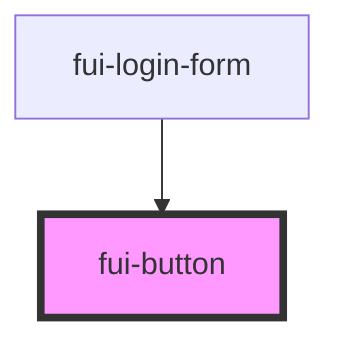

# fui-button

<!-- Auto Generated Below -->

## Properties

| Property    | Attribute    | Description | Type                       | Default     |
| ----------- | ------------ | ----------- | -------------------------- | ----------- |
| `disabled`  | `disabled`   |             | `boolean`                  | `false`     |
| `fullWidth` | `full-width` |             | `boolean`                  | `true`      |
| `size`      | `size`       |             | `"lg" \| "md" \| "sm"`     | `'md'`      |
| `type`      | `type`       |             | `string`                   | `undefined` |
| `variant`   | `variant`    |             | `"primary" \| "secondary"` | `'primary'` |

## Events

| Event      | Description | Type                      |
| ---------- | ----------- | ------------------------- |
| `fuiClick` |             | `CustomEvent<MouseEvent>` |

## Dependencies

### Used by

 - [fui-login-form](../fui-login-form)

### Graph

----------------------------------------------

*Built with [StencilJS](https://stenciljs.com/)*
