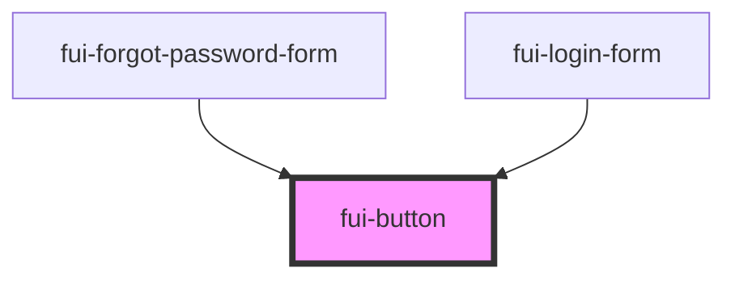

# fui-button

<!-- Auto Generated Below -->

## Properties

| Property    | Attribute    | Description | Type      | Default     |
| ----------- | ------------ | ----------- | --------- | ----------- |
| `fullWidth` | `full-width` |             | `boolean` | `true`      |
| `type`      | `type`       |             | `string`  | `undefined` |

## Events

| Event      | Description | Type                      |
| ---------- | ----------- | ------------------------- |
| `fuiClick` |             | `CustomEvent<MouseEvent>` |

## Dependencies

### Used by

 - [fui-forgot-password-form](../fui-forgot-password-form)
 - [fui-login-form](../fui-login-form)

### Graph

----------------------------------------------

*Built with [StencilJS](https://stenciljs.com/)*
