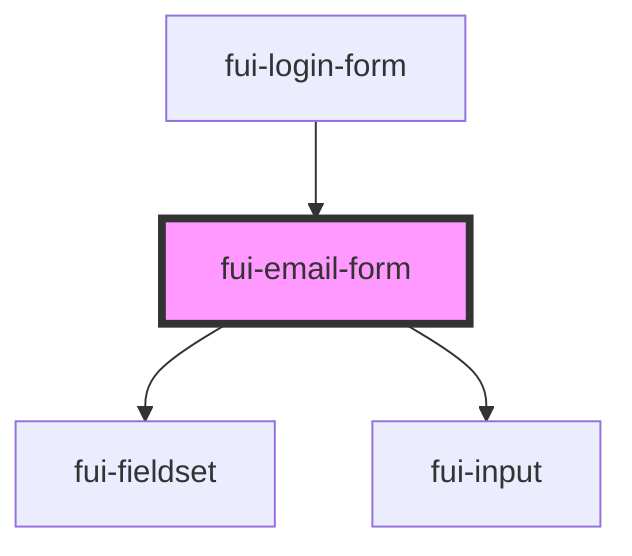

# fui-email-form

<!-- Auto Generated Below -->

## Properties

| Property           | Attribute    | Description | Type                                     | Default     |
| ------------------ | ------------ | ----------- | ---------------------------------------- | ----------- |
| `config`           | --           |             | `ObservableMap<FUIConfig>`               | `undefined` |
| `isSignIn`         | `is-sign-in` |             | `boolean`                                | `true`      |
| `state`            | --           |             | `{ email?: string; password?: string; }` | `undefined` |
| `validationErrors` | --           |             | `{ email?: string; password?: string; }` | `{}`        |

## Events

| Event            | Description | Type                  |
| ---------------- | ----------- | --------------------- |
| `emailChange`    |             | `CustomEvent<string>` |
| `forgotPassword` |             | `CustomEvent<void>`   |
| `passwordChange` |             | `CustomEvent<string>` |
| `toggleAuthMode` |             | `CustomEvent<void>`   |

## Dependencies

### Used by

 - [fui-login-form](../fui-login-form)

### Depends on

- [fui-fieldset](../fui-fieldset)
- [fui-input](../fui-input)

### Graph

----------------------------------------------

*Built with [StencilJS](https://stenciljs.com/)*
