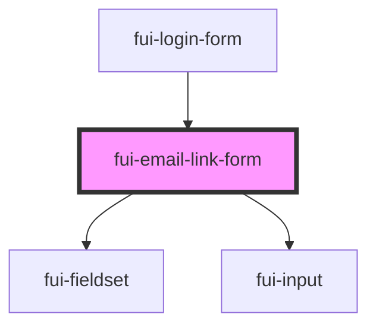

# fui-email-link-form

<!-- Auto Generated Below -->

## Properties

| Property           | Attribute   | Description | Type                       | Default     |
| ------------------ | ----------- | ----------- | -------------------------- | ----------- |
| `config`           | --          |             | `ObservableMap<FUIConfig>` | `undefined` |
| `linkSent`         | `link-sent` |             | `boolean`                  | `false`     |
| `state`            | --          |             | `{ email?: string; }`      | `undefined` |
| `validationErrors` | --          |             | `{ email?: string; }`      | `{}`        |

## Events

| Event         | Description | Type                  |
| ------------- | ----------- | --------------------- |
| `emailChange` |             | `CustomEvent<string>` |

## Dependencies

### Used by

 - [fui-login-form](../fui-login-form)

### Depends on

- [fui-fieldset](../fui-fieldset)
- [fui-input](../fui-input)

### Graph

----------------------------------------------

*Built with [StencilJS](https://stenciljs.com/)*
