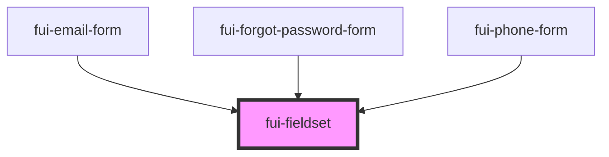

# fui-fieldset

<!-- Auto Generated Below -->

## Properties

| Property   | Attribute   | Description | Type                      | Default     |
| ---------- | ----------- | ----------- | ------------------------- | ----------- |
| `class`    | `class`     |             | `string`                  | `undefined` |
| `error`    | `error`     |             | `boolean`                 | `false`     |
| `helpText` | `help-text` |             | `string`                  | `undefined` |
| `inputId`  | `input-id`  |             | `string`                  | `undefined` |
| `label`    | `label`     |             | `string`                  | `undefined` |
| `props`    | --          |             | `{ [key: string]: any; }` | `undefined` |
| `required` | `required`  |             | `boolean`                 | `false`     |

## Dependencies

### Used by

 - [fui-email-form](../fui-email-form)
 - [fui-forgot-password-form](../fui-forgot-password-form)
 - [fui-phone-form](../fui-phone-form)

### Graph

----------------------------------------------

*Built with [StencilJS](https://stenciljs.com/)*
