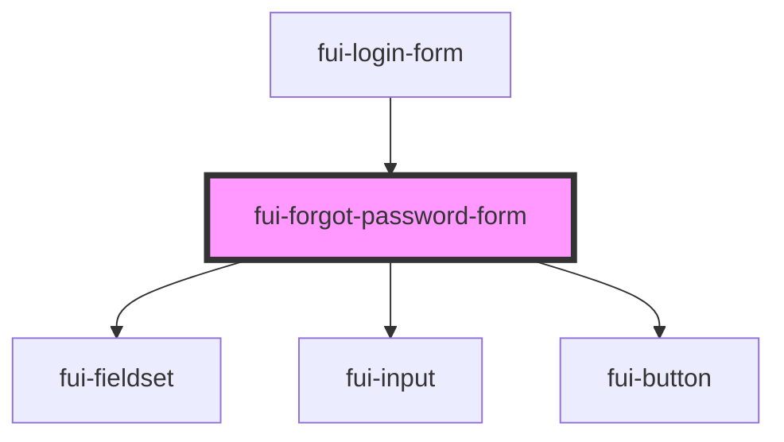

# fui-forgot-password-form

<!-- Auto Generated Below -->

## Properties

| Property         | Attribute         | Description | Type                       | Default     |
| ---------------- | ----------------- | ----------- | -------------------------- | ----------- |
| `config`         | --                |             | `ObservableMap<FUIConfig>` | `undefined` |
| `email`          | `email`           |             | `string`                   | `''`        |
| `error`          | `error`           |             | `string`                   | `undefined` |
| `successMessage` | `success-message` |             | `string`                   | `undefined` |

## Events

| Event         | Description | Type                  |
| ------------- | ----------- | --------------------- |
| `backToLogin` |             | `CustomEvent<void>`   |
| `emailChange` |             | `CustomEvent<string>` |
| `submitReset` |             | `CustomEvent<void>`   |

## Dependencies

### Used by

 - [fui-login-form](../fui-login-form)

### Depends on

- [fui-fieldset](../fui-fieldset)
- [fui-input](../fui-input)
- [fui-button](../fui-button)

### Graph

----------------------------------------------

*Built with [StencilJS](https://stenciljs.com/)*
