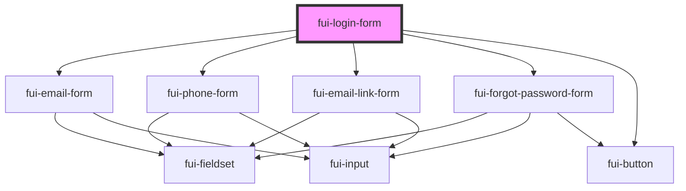

# fui-login-form

<!-- Auto Generated Below -->

## Properties

| Property    | Attribute    | Description | Type                                               | Default     |
| ----------- | ------------ | ----------- | -------------------------------------------------- | ----------- |
| `config`    | --           |             | `ObservableMap<FUIConfig>`                         | `undefined` |
| `formFroms` | --           |             | `{ [key: string]: any; }`                          | `undefined` |
| `loginType` | `login-type` |             | `"anonymous" \| "email" \| "emailLink" \| "phone"` | `'email'`   |

## Methods

### `submit() => Promise<void>`

#### Returns

Type: `Promise<void>`

## Dependencies

### Depends on

- [fui-email-form](../fui-email-form)
- [fui-phone-form](../fui-phone-form)
- [fui-email-link-form](../fui-email-link-form)
- [fui-forgot-password-form](../fui-forgot-password-form)
- [fui-button](../fui-button)

### Graph

----------------------------------------------

*Built with [StencilJS](https://stenciljs.com/)*
