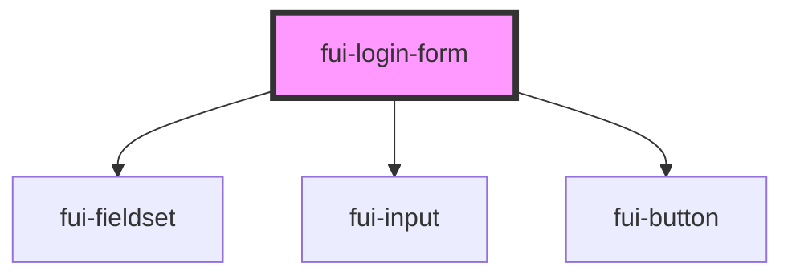

# fui-login-form

<!-- Auto Generated Below -->

## Properties

| Property | Attribute | Description | Type                      | Default     |
| -------- | --------- | ----------- | ------------------------- | ----------- |
| `props`  | --        |             | `{ [key: string]: any; }` | `undefined` |

## Methods

### `submit() => Promise<void>`

#### Returns

Type: `Promise<void>`

## Dependencies

### Depends on

- [fui-fieldset](../fui-fieldset)
- [fui-input](../fui-input)
- [fui-button](../fui-button)

### Graph

----------------------------------------------

*Built with [StencilJS](https://stenciljs.com/)*
