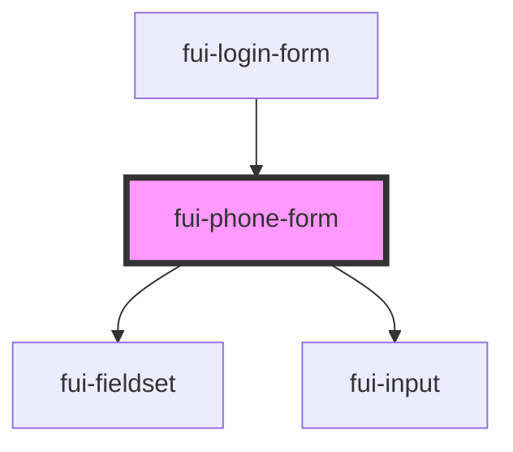

# fui-phone-form

<!-- Auto Generated Below -->

## Properties

| Property           | Attribute           | Description | Type                                                   | Default     |
| ------------------ | ------------------- | ----------- | ------------------------------------------------------ | ----------- |
| `config`           | --                  |             | `ObservableMap<FUIConfig>`                             | `undefined` |
| `state`            | --                  |             | `{ phoneNumber?: string; verificationCode?: string; }` | `undefined` |
| `validationErrors` | --                  |             | `{ phoneNumber?: string; verificationCode?: string; }` | `{}`        |
| `verificationSent` | `verification-sent` |             | `boolean`                                              | `false`     |

## Events

| Event                     | Description | Type                                                                |
| ------------------------- | ----------- | ------------------------------------------------------------------- |
| `canSubmit`               |             | `CustomEvent<boolean>`                                              |
| `formStateChange`         |             | `CustomEvent<{ phoneNumber?: string; verificationCode?: string; }>` |
| `phoneNumberChange`       |             | `CustomEvent<string>`                                               |
| `recaptchaVerified`       |             | `CustomEvent<void>`                                                 |
| `recaptchaVerifierChange` |             | `CustomEvent<RecaptchaVerifier>`                                    |
| `verificationCodeChange`  |             | `CustomEvent<string>`                                               |
| `verificationSentChange`  |             | `CustomEvent<boolean>`                                              |

## Dependencies

### Used by

 - [fui-login-form](../fui-login-form)

### Depends on

- [fui-fieldset](../fui-fieldset)
- [fui-input](../fui-input)

### Graph

----------------------------------------------

*Built with [StencilJS](https://stenciljs.com/)*
